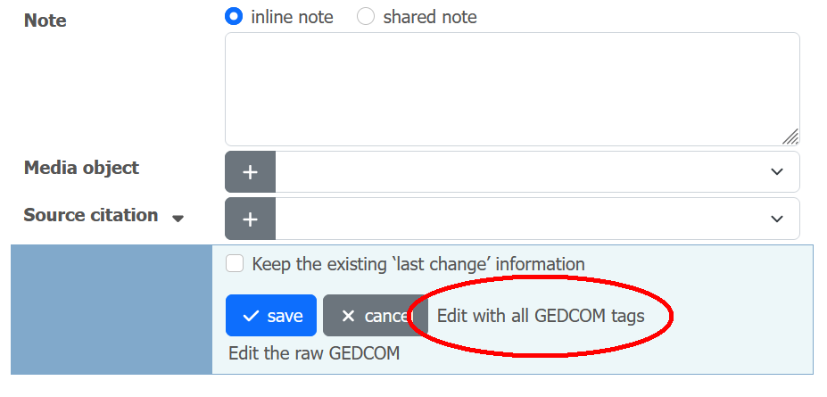
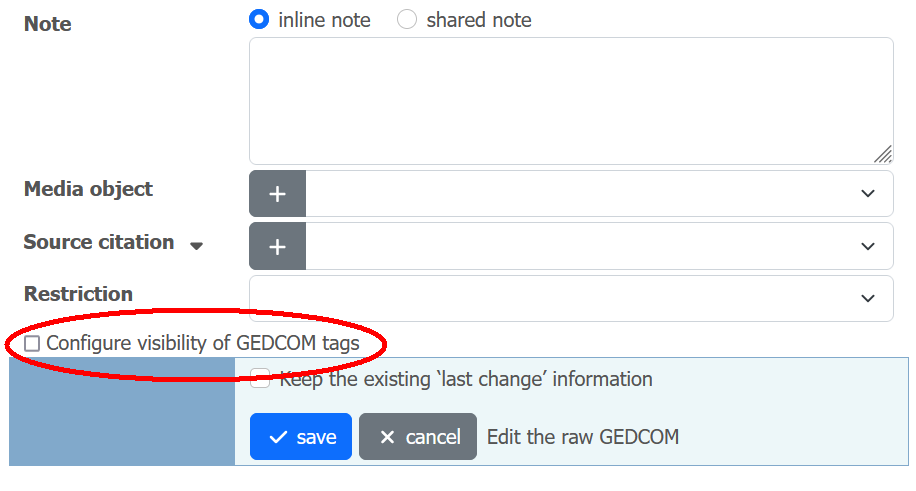
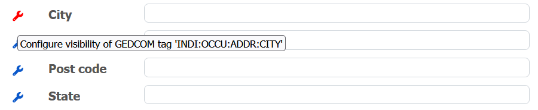
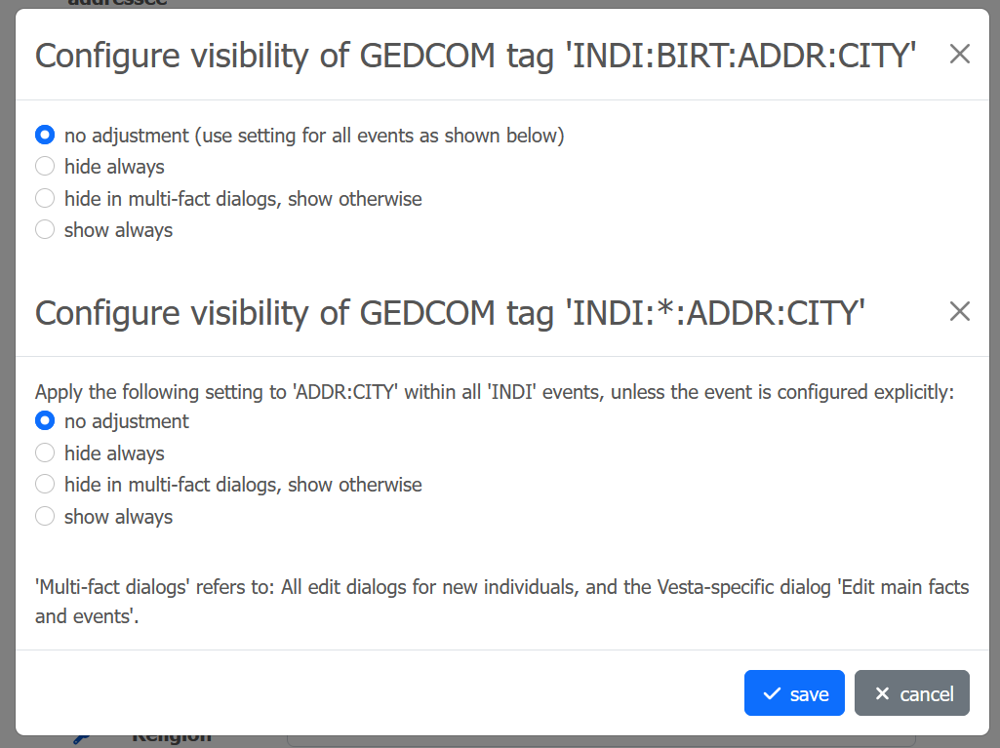

# GEDCOM tags

> The GEDCOM standard provides a large number of data-entry fields, called tags.
> Some of these GEDCOM tags are used infrequently or never used.
> You can simplify the edit forms by hiding GEDCOM tags that you do not use.

This is the intro in the section 'GEDCOM tags' of webtrees' control panel. In that section, you can show or hide some specific tags.
There is, however, no option in webtrees that allows you do this for each specific tag under each specific event.

The 'Vesta Classic Look & Feel' module offers more fine-grained configuration options.

## Configuration of GEDCOM tag visibility

The extended configuration options are not available though the control panel, but when editing an individual or family fact (as an admin)[^1].
The configured adjustments are stored via module settings and therefore affect all users.

[^1]: I have decided to place it there mainly because it is easier to re-use the user interface of the respective edit dialog.

In order to access the options, first select 'Edit with all GEDCOM tags' at the bottom of an edit dialog. In the expanded edit dialog, select the new checkbox 'Configure visibility of GEDCOM tags' just above the controls.

Checking this box reveals additional icons on each single tag, which in turn allow to configure the visibility of the respective tag for the specific event for all future edit dialogs (more specifically the initial dialogs; the full version opened via 'Edit with all GEDCOM tags' is never affected).

The tag-specific dialog offers a number of options, which in particular allow to hide additional fields in the edit dialogs for new individuals.

## Notes

[See this forum thread for further discussion.](https://www.webtrees.net/index.php/en/forum/4-customising/37154-customization-of-gedcom-tag-visibility)
