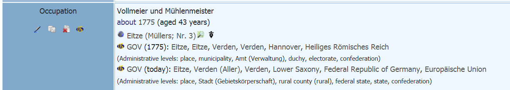
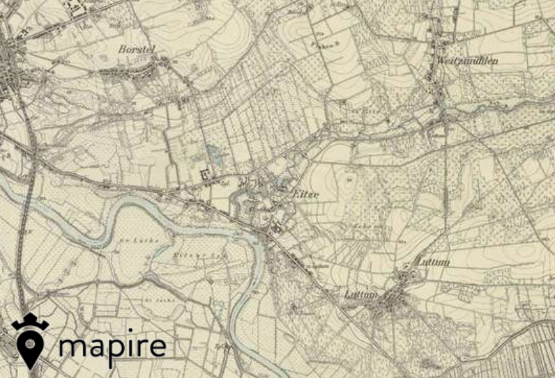
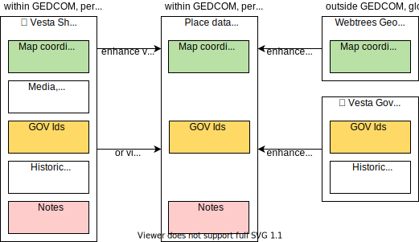
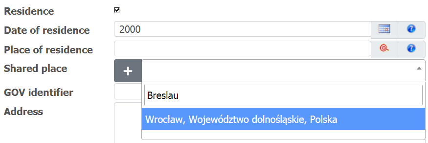
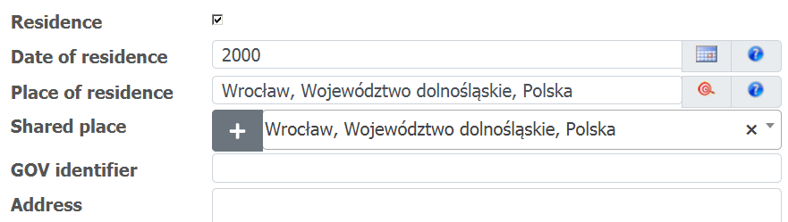
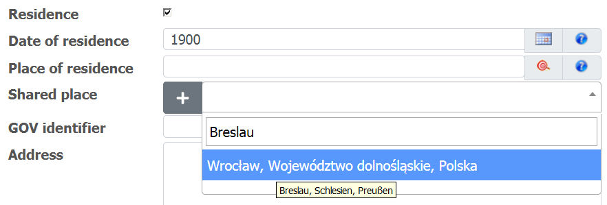
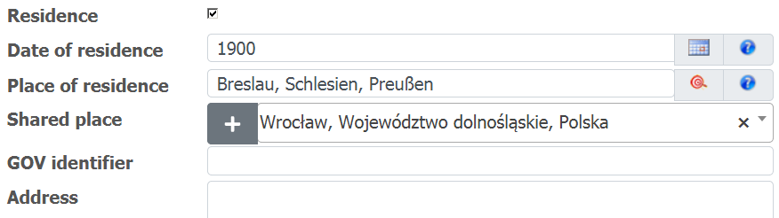

# Location Data Management

This document describes various ways of managing location data in webtrees, based on functionality provided by the Vesta custom modules.

## Contents

* [Introduction](#introduction)
* [Location Data](#location-data)
* [Use Cases](#use-cases)
* [First Steps](#first-steps)

## Introduction

In the current [GEDCOM specification 5.5.1](https://www.familysearch.org/developers/docs/guides/gedcom), there are no top-level location records which would allow to re-use location data in different places. It is possible to add some data to a specific place record (such as a PLAC under an individual or family event), but even this is restricted to map coordinates and notes.

Webtrees by itself allows to map locations to map coordinates globally, via the 'Geographic data' functionality in the control panel. These mappings are stored independently of your tree data, outside GEDCOM.

The Vesta custom modules provide functionality that overcomes these limitations.

## Location Data

There are different ways to manage different kinds of location data. Based on your use case, you'll have to enable and configure the respective custom modules accordingly. In any case, the location data is then used by the 'Vesta Facts and events' module, which enhances the data displayed for individual and family events, as shown in this example for shared place data:

The same place enhanced instead with historical GOV data:

Also note the links to external maps, including a historical map of Europe in the 19th century:

Map coordinates are also used by the 'Vesta Places and pedigree map' module for place lists and maps. 

The following diagram gives an overview of the Vesta custom modules. Modules displaying data (via lists, tabs, and charts) are in the top row, with a green background. Modules also provide location data (red background) and other data (orange background) to other modules.

The following diagram gives an overview of the different kinds of location data, and the different ways to manage this data.

### Place-specific location data (within GEDCOM)

The GEDCOM specification itself only allows to store location data at specific event places. 
In general is not recommended to actually use this extensively, as it leads to redundant data. 
If you e.g. want to add a note to a place, you'll have to repeat it wherever the place occurs within an event. 
In specific cases, this feature is still useful though: You may have more specific data, such as map coordinates for a specific event (e.g. for the location of a gravestone, where the respective location data managed elsewhere only provides map coordinates for the respective cemetary).

### Global location data (outside GEDCOM)

Webtrees itself, as well as the 'Vesta Gov4Webtrees' module by itself, address this issue by managing location data elsewhere, outside the GEDCOM data.
This location data is then mapped via place names to event places.

Compared to top-level location records within GEDCOM, this approach is less flexible and problematic with regard to importing and exporting, but it may still useful in these cases:
* you have multiple trees and want to avoid redundant location data
* you are not comfortable with using a non-standard GEDCOM extension
* you regularly import your GEDCOM file from another application and actually don't want to modify it within webtrees

How does it work in detail?
* Map coordinates: This is how webtrees itself manages geographic data via the control panel. 
This geographic data isn't used everywhere, though (it is used for maps within webtrees, but not for links to external maps in the original 'Facts and events' module). 
The 'Vesta Webtrees Location Data Provider' module rectifies this.
* Historical data: The 'Vesta Gov4Webtrees' module by itself provides historical data (obtained from the GOV historical gazetteer) via place names. 
The respective edit controls are provided next to event places for convenience, but actually refer to global place names.

### Top-level location data (within GEDCOM)

The [Gedcom-L Addendum to the GEDCOM 5.5.1 specification](https://genealogy.net/GEDCOM/) defines top-level location records. 
The 'Shared Places' module is based on this addendum. It allows to add map coordinates, notes, sources, media objects and multiple names to shared places.
A shared place may also have one or more higher-level shared places, which allows to model hierarchies. 
As shared place names and hierarchies may additionally be restricted to specific dates, it is also possible to model historical data, in a similar way to the historical gazetteer data provided by the GOV historical gazetteer. 
Modelling historical data extensively requires a lot of effort, and in general it is recommended to use available GOV data instead if possible. 

## Use Cases

### Using explicit references

According to the Gedcom-L Addendum, places are linked to top-level location records via XREFs (just like e.g. shared notes are linked to events).

If you intend to use top-level location records extensively, this is the recommended option.
Whenever you enter a place name, you now have the option to choose an existing shared place, or to create one. 
By default, the shared place name is used as the event place name so you don't have to enter both explicitly. 
If you have date-specific shared place names and/or hierarchies, the event date is taken into account (even when edited on-the-fly) when the place named is filled in from the shared place.

In the following example, a shared place is found for an event in 2000 (note also how any shared place name matches the search string). Search results are always displayed using the name for today, for consistency.

Searching for the same shared place for an event in 1900 returns the same results, but the tooltip indicates the name for the given date, which is then used to fill in the event place name:

Once you manually change the event place name, it will no longer be synchronized with shared place names. 
Conversely, you can also enter the event place name first and create a shared place based on this name. 

There is a data fix available which adds these XREFs where possible (earlier versions of the 'Shared Places' module did not provide these edit controls).

### Shared place hierarchies

Shared places may be hierarchical, similar to regular places. Hierarchical relationships between shared places are modelled via explicit links (XREFs to higher-level shared places). This allows to model more complex relationships than via the place hierarchy itself, which uses comma-separated place name parts to indicate the hierarchy. When creating a shared place from a given place name, any missing higher-level shared places are created as well:

As hierarchical shared places have not been supported by earlier versions of this custom module, you may have to use a data fix in order to convert existing shared places (having comma-separated name parts), as a one-time migration. This will only affect shared place records of the respective GEDCOM file. 
It is also possible, but no longer recommended, to use shared place names with comma-separated parts indicating a hierarchy.

### Migrating data

Additional data fixes, e.g. for migrating webtrees geographic data to shared places, will be provided in future versions of the 'Shared Places' module. All GEDCOM files containing _LOC-records exported from other programs should be importable directly.  

## First Steps

The easiest way to familiarize yourself with all available functionality and to decide what to use is probably to experiment a bit. 
You can start by using the default configuration options. Create a few shared places, perhaps including GOV ids, and see how everything interacts.
See also the Readme files in each module, and experiment with the configuration options. 
Preferably backup your tree first, even if the options in general can be considered to be save in the sense that they will not delete or convert any of your data.

Once you have decided how to continue, you can use the respective data fixes in order to adjust existing data.
